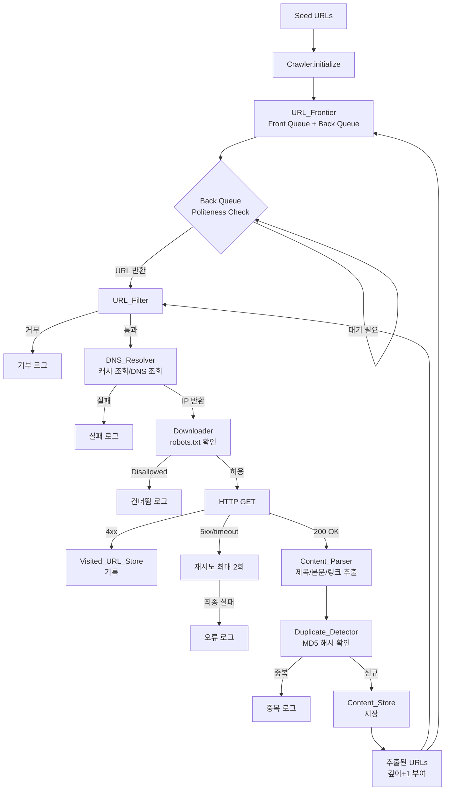
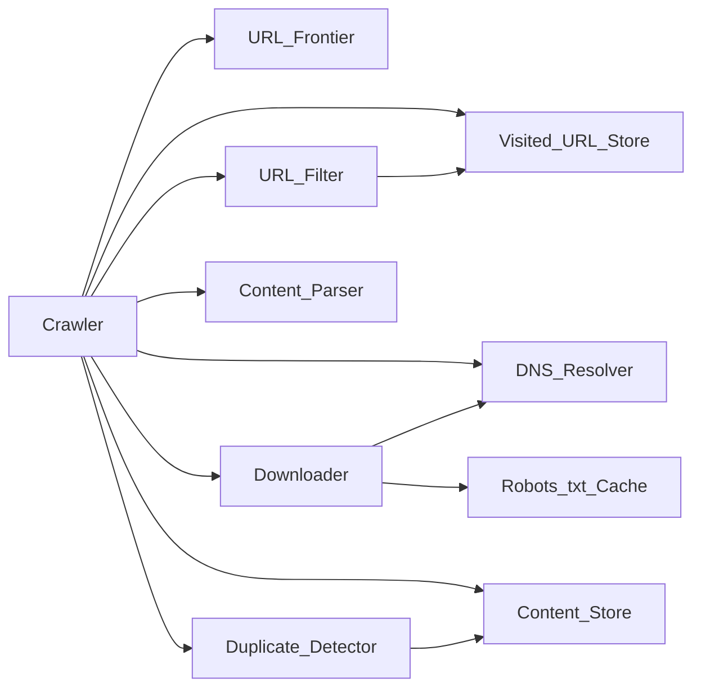

# 설계 문서: web-crawler-toy

## 개요

웹 크롤러 토이 프로젝트는 실제 대규모 웹 크롤러의 핵심 아키텍처를 학습 목적으로 Python으로 구현합니다. BFS 탐색, URL Frontier(우선순위 큐 + 예의 큐), robots.txt 준수, 중복 콘텐츠 감지, DNS 캐싱 등 핵심 컴포넌트를 명확한 인터페이스로 분리하여 각 개념을 독립적으로 이해하고 테스트할 수 있도록 설계합니다.

**토이 규모 목표:**
- 동시 크롤링 대상: 최대 1,000개 도메인
- 단일 세션당 최대 10,000 페이지
- 크롤링 깊이: 최대 5단계

**기술 스택:**
- 언어: Python 3.10+
- HTTP: `requests`
- HTML 파싱: `BeautifulSoup4`
- 테스팅: `pytest` + `hypothesis`
- HTTP 모킹: `responses` (pytest 플러그인)

---

## 아키텍처

### 전체 흐름

크롤러는 단일 프로세스 내 순차 BFS 루프로 동작합니다. 각 컴포넌트는 명확한 책임 경계를 가진 클래스로 구현되며, `Crawler` 오케스트레이터가 이들을 조합합니다.



### 컴포넌트 의존 관계



`Crawler`는 모든 컴포넌트를 소유하며, 각 컴포넌트는 자신의 역할에만 집중합니다. 컴포넌트 간 직접 참조는 위 의존 관계로 제한합니다.

---

## 컴포넌트 및 인터페이스

### CrawlerConfig

크롤러 설정을 담는 불변 데이터 클래스입니다.

```python
from dataclasses import dataclass

@dataclass(frozen=True)
class CrawlerConfig:
    max_depth: int = 3           # 1~10
    max_pages: int = 1000        # 1~100,000
    politeness_delay: float = 1.0  # 0~60초
    save_to_file: bool = False
    output_path: str = "crawl_output.jsonl"
```

유효성 검사는 `Crawler.initialize()` 진입 시 수행합니다.

---

### URLFrontier

```python
class URLFrontier:
    def push(self, url: str, priority: float, depth: int) -> bool:
        """URL을 Front Queue에 삽입. 중복이면 False 반환."""

    def pop(self) -> tuple[str, int] | None:
        """Back Queue Politeness 검사 후 (url, depth) 반환. 비어 있으면 None."""

    def is_empty(self) -> bool: ...

    def set_host_delay(self, host: str, seconds: float) -> None:
        """호스트별 Politeness_Delay 지정. robots.txt Crawl-delay 반영용 (기본값보다 우선)."""
```

**Front Queue:** `heapq`를 이용한 최대 힙 (priority 내림차순, 동점은 삽입 순번 FIFO). 시드 외 URL의 priority는 `1.0 / (1 + depth)`로 부여해 BFS 깊이 순서를 보존합니다.
**Back Queue:** 호스트별 `deque` 딕셔너리 + 마지막 요청 시각 딕셔너리.

`pop()` 내부 동작:
1. Front Queue에서 가장 높은 우선순위 URL을 꺼냄
2. 해당 호스트의 Back Queue 버킷에 삽입
3. 버킷에서 Politeness_Delay 경과 여부 확인 후 반환

중복 판별은 `set`을 사용한 O(1) 문자열 완전 일치입니다.

---

### DNSResolver

```python
class DNSResolver:
    def resolve(self, host: str) -> str | None:
        """IP 주소 반환. 실패 시 None."""
```

내부 캐시: `dict[str, tuple[str, float]]` — `{host: (ip, expire_timestamp)}`.
기본 TTL: 600초. TTL 만료 시 캐시 제거 후 재조회.
DNS 조회 실패(NXDOMAIN, 타임아웃 등) 시 `None` 반환.

---

### RobotsTxtCache

```python
class RobotsTxtCache:
    def is_allowed(self, url: str) -> bool:
        """User-agent: * 기준으로 URL 크롤링 허용 여부 반환."""

    def get_crawl_delay(self, domain: str) -> float | None:
        """Crawl-delay 지시어 값 반환. 없으면 None."""

    def fetch_and_cache(self, domain: str, scheme: str) -> None:
        """robots.txt HTTP 요청 후 캐싱. 실패 시 빈 규칙 저장."""
```

파싱은 Python 표준 라이브러리 `urllib.robotparser.RobotFileParser`를 활용합니다.

---

### Downloader

```python
class Downloader:
    def download(self, url: str, depth: int) -> DownloadResult:
        """HTML 다운로드. robots.txt 확인 포함."""

@dataclass
class DownloadResult:
    url: str
    status: str          # "ok" | "skipped" | "error" | "redirect"
    html: str | None
    redirect_url: str | None
    error_reason: str | None
```

- 30초 타임아웃 적용
- 5xx / 타임아웃: 5초 간격 최대 2회 재시도
- 301/302: Location 헤더 추출, 리다이렉트 횟수 5회 초과 시 중단
- Content-Type이 `text/html`이 아니면 스킵

---

### ContentParser

```python
class ContentParser:
    def parse(self, html: str, base_url: str) -> ParsedPage:
        """HTML 파싱. base_url 기준 상대 경로 절대 URL 변환."""

@dataclass
class ParsedPage:
    url: str
    title: str
    body_text: str
    extracted_urls: list[str]
```

- `<script>`, `<style>`, `<nav>`, `<footer>` 태그 제거 후 텍스트 추출
- `href` 추출: `http(s)://`, `/`, `./`, `../` 시작만 포함
- `javascript:`, `mailto:`, `#` 시작 제외
- 상대 경로 → `urllib.parse.urljoin(base_url, href)` 변환
- 파싱 예외 시 빈 `ParsedPage` 반환

---

### DuplicateDetector

```python
class DuplicateDetector:
    def check_and_register(self, url: str, body_text: str) -> DuplicateResult:
        """중복 여부 판정 및 해시 등록."""

@dataclass
class DuplicateResult:
    verdict: str     # "new" | "duplicate" | "empty"
    md5_hash: str
```

- 본문에서 HTML 태그 제거 + 앞뒤 공백 제거 후 MD5 계산
- 해시 저장소: `dict[str, str]` — `{md5_hash: url}`
- 빈 본문은 `"empty"` 판정 → Content_Store 저장 허용

---

### URLFilter

```python
class URLFilter:
    def is_allowed(self, url: str, depth: int) -> tuple[bool, str | None]:
        """(허용 여부, 거부 사유) 반환."""
```

검사 순서 (첫 번째 위반에서 중단):
1. 스킴이 `http` 또는 `https`인지
2. URL 길이 2,048자 초과 여부
3. 최대 크롤링 깊이 초과 여부
4. 경로 세그먼트 3회 반복 패턴 여부 (대소문자 무시)
5. `Visited_URL_Store` 방문 여부

---

### VisitedURLStore

```python
class VisitedURLStore:
    def add(self, url: str) -> None: ...
    def contains(self, url: str) -> bool: ...
    def count(self) -> int: ...
```

내부 저장: `set[str]` — O(1) 조회/삽입.

---

### ContentStore

```python
class ContentStore:
    def save(self, page: StoredPage) -> None: ...
    def get(self, url: str) -> StoredPage | None: ...
    def all_urls(self) -> list[str]: ...
    def count(self) -> int: ...
    def flush_to_file(self, path: str) -> None: ...

@dataclass
class StoredPage:
    url: str
    title: str
    body_text: str
    extracted_urls: list[str]
    crawled_at: str    # UTC ISO 8601
    md5_hash: str
```

내부 저장: `dict[str, StoredPage]` — O(1) 조회.
파일 저장: JSON Lines 형식, 최대 10,000 레코드.

---

### Crawler (오케스트레이터)

```python
class Crawler:
    @staticmethod
    def initialize(seed_urls: list[str], config: CrawlerConfig) -> "Crawler":
        """유효성 검사 후 Crawler 인스턴스 생성."""

    def run(self) -> CrawlSummary:
        """BFS 루프 실행 후 요약 통계 반환."""

@dataclass
class CrawlSummary:
    total_pages: int
    skipped_urls: int
    duplicate_count: int
    elapsed_seconds: float
```

BFS 루프:
1. `URL_Frontier.pop()` → URL, depth 획득
2. `URL_Filter.is_allowed()` → 거부 시 로그 + 카운터 증가
3. `DNS_Resolver.resolve()` → 실패 시 스킵
4. `Downloader.download()` → 결과에 따라 분기
5. 성공 시 `Content_Parser.parse()` → `Duplicate_Detector.check_and_register()`
6. 신규 콘텐츠면 `Content_Store.save()` → 추출 URL 필터링 후 `URL_Frontier.push()`
7. `Content_Store.count() >= max_pages` 도달 시 루프 종료

---

## 데이터 모델

### URL 메타데이터 (URLFrontier 내부)

| 필드 | 타입 | 설명 |
|------|------|------|
| `url` | `str` | 완전한 절대 URL |
| `priority` | `float` | 우선순위 점수 (초기 시드: 1.0) |
| `depth` | `int` | 시드 URL로부터의 깊이 (시드: 0) |

### DNS 캐시 레코드

| 필드 | 타입 | 설명 |
|------|------|------|
| `host` | `str` | 도메인 이름 (키) |
| `ip` | `str` | IPv4/IPv6 주소 |
| `expire_at` | `float` | `time.time() + TTL` |

### 저장 페이지 (ContentStore)

| 필드 | 타입 | 설명 |
|------|------|------|
| `url` | `str` | 페이지 URL (키) |
| `title` | `str` | `<title>` 텍스트, 없으면 `""` |
| `body_text` | `str` | 노이즈 제거된 본문 텍스트 |
| `extracted_urls` | `list[str]` | 추출된 절대 URL 목록 |
| `crawled_at` | `str` | UTC ISO 8601 (`2024-01-01T00:00:00Z`) |
| `md5_hash` | `str` | 본문 텍스트의 MD5 16진수 문자열 |

### 중복 해시 저장소 (DuplicateDetector 내부)

| 필드 | 타입 | 설명 |
|------|------|------|
| `md5_hash` | `str` | MD5 16진수 문자열 (키) |
| `first_url` | `str` | 최초 등록된 URL |

### 디렉터리 구조 (제안)

```
web_crawler/
├── crawler.py          # Crawler 오케스트레이터
├── config.py           # CrawlerConfig
├── frontier.py         # URLFrontier
├── dns_resolver.py     # DNSResolver
├── robots_cache.py     # RobotsTxtCache
├── downloader.py       # Downloader
├── parser.py           # ContentParser
├── duplicate.py        # DuplicateDetector
├── url_filter.py       # URLFilter
├── visited_store.py    # VisitedURLStore
├── content_store.py    # ContentStore
└── models.py           # 공통 dataclass 정의
tests/
├── test_frontier.py
├── test_dns_resolver.py
├── test_parser.py
├── test_duplicate.py
├── test_url_filter.py
├── test_visited_store.py
├── test_content_store.py
├── test_downloader.py
└── test_crawler.py
```

---

## 정확성 속성 (Correctness Properties)

*속성(Property)은 시스템의 모든 유효한 실행에서 참이어야 하는 특성 또는 동작입니다. 즉, 시스템이 무엇을 해야 하는지에 대한 공식적인 진술입니다. 속성은 사람이 읽을 수 있는 명세와 기계가 검증 가능한 정확성 보장 사이의 다리 역할을 합니다.*

---

### 속성 1: URL Frontier 중복 삽입 거부 (멱등성)

**모든** 유효한 URL에 대해, URL_Frontier에 동일한 URL을 두 번 이상 삽입하더라도 내부 집합의 크기는 1만큼만 증가해야 한다.

**검증 대상: 요구사항 2.7**

---

### 속성 2: URL_Frontier 우선순위 순서 보존

**모든** URL 삽입 순서와 우선순위 조합에 대해, `pop()`이 반환하는 URL 시퀀스는 우선순위 내림차순을 위반하지 않아야 한다.

**검증 대상: 요구사항 2.1, 2.4**

---

### 속성 3: DNS 캐시 TTL 만료 후 재조회

**모든** 호스트와 TTL 설정에 대해, TTL이 만료된 상태에서 `resolve()`를 호출하면 캐시된 결과를 반환하지 않고 새로운 DNS 조회를 수행해야 한다.

**검증 대상: 요구사항 3.4**

---

### 속성 4: ContentParser 추출 URL 유효성 (절대 URL + 금지 스킴 제외)

**모든** HTML 문자열과 기준 URL 조합에 대해, `ContentParser.parse()`가 반환하는 `extracted_urls`의 모든 항목은 `http://` 또는 `https://`로 시작하는 절대 URL이어야 하며, `javascript:`, `mailto:`, `#`으로 시작하는 URL은 포함되어선 안 된다.

**검증 대상: 요구사항 6.4, 6.5**

---

### 속성 5: DuplicateDetector 동일 본문 → 중복 판정 일관성

**모든** 본문 텍스트 문자열에 대해, 동일한 본문 텍스트를 가진 두 개의 서로 다른 URL을 순서대로 등록하면 두 번째는 반드시 `"duplicate"` 판정을 받아야 하며, 반환되는 `md5_hash`는 두 호출 모두 동일한 값이어야 한다 (MD5 결정론성 포함).

**검증 대상: 요구사항 7.1, 7.2**

---

### 속성 6: URLFilter 거부 규칙 반환값 일관성 (메타 속성)

**모든** URL에 대해, `is_allowed()`가 `False`를 반환하면 반드시 거부 사유 문자열이 함께 반환되어야 하며, `True`를 반환하면 사유는 `None`이어야 한다.

**검증 대상: 요구사항 8.6**

---

### 속성 7: URLFilter 경로 세그먼트 반복 패턴 감지

**모든** URL 경로에 대해, 동일한 세그먼트가 대소문자 구분 없이 3회 이상 반복되면 `is_allowed()`는 반드시 `False`를 반환해야 한다.

**검증 대상: 요구사항 8.3**

---

### 속성 8: VisitedURLStore 멱등성 (idempotency)

**모든** URL 집합에 대해, 동일한 URL을 `add()`로 여러 번 삽입하더라도 `count()`는 고유 URL 수와 동일해야 한다.

**검증 대상: 요구사항 9.1, 9.4**

---

### 속성 9: ContentStore 저장-조회 라운드트립

**모든** `StoredPage` 인스턴스에 대해, `save(page)` 후 `get(page.url)`을 호출하면 원본과 모든 필드가 동등한 객체를 반환해야 한다.

**검증 대상: 요구사항 11.1, 11.3**

---

### 속성 10: ContentStore 덮어쓰기 후 최신값 반환 (last-writer-wins)

**모든** URL에 대해, 동일한 URL로 두 번 `save()`를 호출한 후 `get()`을 호출하면 두 번째로 저장된 값을 반환해야 한다.

**검증 대상: 요구사항 11.1**

---

### 속성 11: Crawler 초기화 시 중복 Seed URL 제거

**모든** 중복을 포함한 Seed URL 목록에 대해, `Crawler.initialize()` 후 URL_Frontier에 삽입된 URL 수는 목록의 고유 유효 URL 수와 동일해야 한다.

**검증 대상: 요구사항 1.7**

---

## 오류 처리

### 오류 분류 및 처리 정책

| 상황 | 처리 방식 |
|------|-----------|
| 빈 Seed URL 목록 | `ValueError` 발생, 세션 미시작 |
| 설정값 범위 초과 | `ValueError` 발생, 세션 미시작 |
| 잘못된 스킴의 Seed URL | 경고 로그, 해당 URL 제외 후 계속 |
| DNS 조회 실패 | 경고 로그, 해당 URL 스킵 |
| robots.txt 다운로드 실패 | 빈 규칙 적용, 경고 로그 |
| HTTP 4xx | 방문 기록 후 스킵, 경고 로그 |
| HTTP 5xx / 타임아웃 | 5초 간격 2회 재시도, 최종 실패 시 오류 로그 |
| 리다이렉트 5회 초과 | 오류 로그, 스킵 |
| Content-Type 불일치 | 스킵 (로그 없음, 정상 케이스) |
| HTML 파싱 예외 | 빈 `ParsedPage` 반환, 오류 로그 |
| 파일 저장 실패 | 오류 로그, 요약 통계에 반영 |

### 로깅 전략

Python 표준 `logging` 모듈을 사용합니다.

- `DEBUG`: DNS 캐시 히트/미스, robots.txt 캐시 히트
- `INFO`: 페이지 성공 저장, 크롤링 세션 시작/종료
- `WARNING`: URL 거부(URLFilter), DNS 실패, 4xx 응답, Content-Type 불일치
- `ERROR`: 재시도 후 최종 실패, HTML 파싱 오류, 파일 저장 오류

---

## 테스팅 전략

### 이중 테스트 접근법

단위 테스트(예시 기반)와 속성 기반 테스트(PBT)를 함께 사용합니다. 단위 테스트는 구체적인 시나리오와 경계 조건을 검증하고, 속성 기반 테스트는 넓은 입력 공간에 대해 보편적 속성을 검증합니다.

### 속성 기반 테스트 (Hypothesis)

`pytest` + `hypothesis` 라이브러리를 사용합니다. 각 속성 테스트는 최소 **100회** 이상 반복 실행됩니다.

각 속성 테스트에는 다음 형식의 태그를 주석으로 명시합니다:
```
# Feature: web-crawler-toy, Property {번호}: {속성 텍스트 요약}
```

**속성 테스트 대상:**

| 속성 | 테스트 파일 | Hypothesis 전략 |
|------|------------|-----------------|
| 속성 1: URL Frontier 중복 삽입 거부 | `test_frontier.py` | `st.lists(st.urls(), min_size=1)` |
| 속성 2: URL Frontier 우선순위 순서 | `test_frontier.py` | `st.lists(st.tuples(st.text(), st.floats(0,1)))` |
| 속성 3: DNS TTL 만료 재조회 | `test_dns_resolver.py` | `st.text(), st.floats(min_value=0)` (모킹) |
| 속성 4: 상대 경로 절대 URL 변환 | `test_parser.py` | `st.from_regex(r'https?://\w+\.\w+')` |
| 속성 5: 금지 스킴 제외 | `test_parser.py` | `st.text()` + `javascript:/mailto:/#` 주입 |
| 속성 6: 동일 본문 → 중복 판정 | `test_duplicate.py` | `st.text()` |
| 속성 7: MD5 결정론성 | `test_duplicate.py` | `st.text()` |
| 속성 8: 거부 규칙 반환값 일관성 | `test_url_filter.py` | `st.text(min_size=1)` |
| 속성 9: 경로 세그먼트 반복 감지 | `test_url_filter.py` | `st.lists(st.text(), min_size=3)` |
| 속성 10: VisitedURLStore 멱등성 | `test_visited_store.py` | `st.lists(st.text(), min_size=1)` |
| 속성 11: ContentStore 라운드트립 | `test_content_store.py` | `st.builds(StoredPage, ...)` |
| 속성 12: ContentStore 덮어쓰기 | `test_content_store.py` | `st.builds(StoredPage, ...)` x2 |

### 단위 테스트 (pytest 예시 기반)

외부 HTTP 요청은 `responses` 라이브러리로 모킹합니다.

**주요 시나리오:**

- `Downloader`: 200/301/302/4xx/5xx/타임아웃 각 케이스, 재시도 횟수 검증
- `RobotsTxtCache`: `Disallow`, `Crawl-delay`, robots.txt 404 케이스
- `URLFilter`: 스킴 오류, 길이 초과, 깊이 초과, 경로 반복, 방문 중복 각각
- `Crawler.initialize()`: 빈 seed, 잘못된 설정값 범위, 중복 seed 제거
- `Crawler.run()`: `max_pages` 도달 시 종료, BFS 깊이 순서 검증

### 통합 테스트

`pytest-httpserver`로 로컬 HTTP 서버를 띄워 전체 BFS 루프를 검증합니다.

- 3~5개 페이지의 소규모 사이트 시뮬레이션
- 크롤링 결과 `ContentStore` 내용 검증
- 요약 통계(`CrawlSummary`) 정확성 검증
