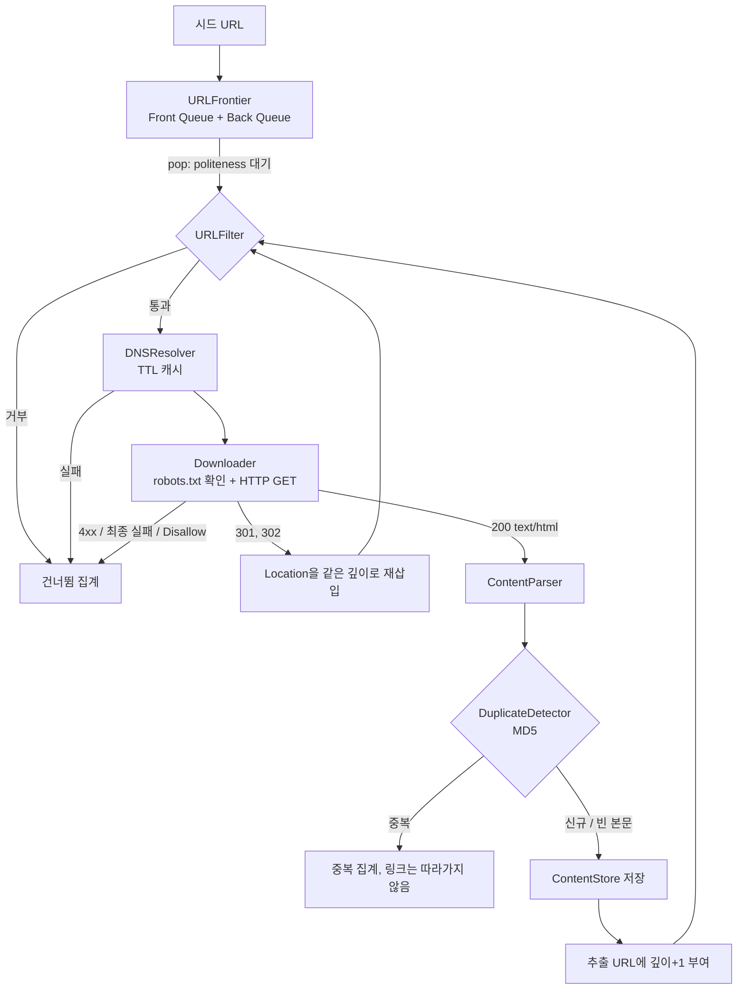

# Web Crawler Design

웹 크롤러 시스템 설계의 핵심 개념을 학습하려고 Python으로 직접 구현한 토이 프로젝트입니다.
BFS 탐색, URL Frontier(우선순위 큐 + 예의 큐), robots.txt 준수, 중복 콘텐츠 감지, DNS 캐싱 같은
대규모 크롤러의 구성 요소를 작은 규모로 줄여 코드로 확인할 수 있게 만들었습니다.

- 단일 프로세스, 순차 BFS 루프
- 기본 설정: 깊이 3, 최대 1,000페이지, 같은 호스트 요청 간격 1초
- 허용 범위: 깊이 1~10, 페이지 1~100,000, 간격 0~60초

명세와 설계는 [`.kiro/specs/web-crawler-toy/`](.kiro/specs/web-crawler-toy)의 `requirements.md`(요구사항 11개)와 `design.md`에 있고, 작업 계획은 [`.omc/plans/web-crawler-toy-tasks.md`](.omc/plans/web-crawler-toy-tasks.md)에 있습니다.

## 빠르게 실행하기

Python 3.10 이상이 필요합니다.

```bash
python3 -m venv .venv
.venv/bin/pip install -r requirements.txt

# 크롤링 실행
.venv/bin/python -m web_crawler https://example.com --max-depth 2 --max-pages 50

# 결과를 JSON Lines 파일로 저장
.venv/bin/python -m web_crawler https://example.com --output result.jsonl

# 테스트 실행
.venv/bin/pytest -q
```

크롤링이 끝나면 요약 통계가 표준 출력으로 나옵니다.

```
=== 크롤링 요약 ===
수집한 페이지 수: 3
건너뛴 URL 수: 0
중복 감지 수: 0
소요 시간: 0.01초
```

### 옵션

| 옵션 | 기본값 | 설명 |
|------|--------|------|
| `SEED_URL ...` | (필수) | 시작 URL. 하나 이상, `http://` 또는 `https://`로 시작해야 함 |
| `--max-depth N` | 3 | 시드로부터 따라갈 최대 링크 깊이 (1~10) |
| `--max-pages N` | 1000 | 저장할 최대 페이지 수 (1~100,000) |
| `--delay SEC` | 1.0 | 같은 호스트에 대한 요청 간 최소 간격 (0~60초) |
| `--output PATH` | 없음 | 수집 결과를 저장할 JSON Lines 파일 (최대 10,000 레코드) |
| `-v`, `--verbose` | 꺼짐 | INFO 로그 출력 |

종료 코드: 정상 `0`, 잘못된 입력(빈/무효 시드, 범위 밖 설정) `2`, 파일 저장 실패 `1`.

라이브러리로 쓸 때는 다음과 같습니다.

```python
from web_crawler.config import CrawlerConfig
from web_crawler.crawler import Crawler

crawler = Crawler.initialize(["https://example.com"], CrawlerConfig(max_depth=2, max_pages=50))
summary = crawler.run()
page = crawler.store.get("https://example.com")
```

## 동작 흐름



## 구조

```
web_crawler/
├── crawler.py        Crawler: 초기화 검증, BFS 루프, 요약 출력
├── config.py         CrawlerConfig, 범위 검증
├── frontier.py       URLFrontier: 우선순위 힙 + 호스트별 예의 큐
├── dns_resolver.py   DNSResolver: TTL 캐시
├── robots_cache.py   RobotsTxtCache: 도메인별 robots.txt 캐시
├── downloader.py     Downloader: 재시도, 리다이렉트, Content-Type 검사
├── parser.py         ContentParser: 제목, 본문, 링크 추출
├── duplicate.py      DuplicateDetector: MD5 기반 중복 판정
├── url_filter.py     URLFilter: 크롤러 트랩 방지
├── visited_store.py  VisitedURLStore: 방문 URL 집합
├── content_store.py  ContentStore: 페이지 저장, JSON Lines 내보내기
├── models.py         공통 dataclass
└── __main__.py       CLI 진입점
tests/                컴포넌트별 테스트 + 통합 테스트
```

| 컴포넌트 | 요구사항 | 핵심 |
|----------|----------|------|
| `Crawler` | 1, 10, 11.5~11.6 | 시드 검증·중복 제거, BFS, 요약 통계 |
| `URLFrontier` | 2 | 우선순위 힙, 호스트별 버킷, politeness 대기 |
| `DNSResolver` | 3 | 기본 TTL 600초, 만료 시 제거 후 재조회, 실패는 `None` |
| `RobotsTxtCache` | 4 | `User-agent: *` Disallow prefix 매칭, Crawl-delay 상한 300초 |
| `Downloader` | 5, 9.2~9.3 | 30초 타임아웃, 5xx·타임아웃은 5초 간격 최대 2회 재시도 |
| `ContentParser` | 6 | script/style/nav/footer 제거, 상대 경로 절대화 |
| `DuplicateDetector` | 7 | 태그·앞뒤 공백 제거 후 MD5, `new`/`duplicate`/`empty` |
| `URLFilter` | 8 | 스킴, 길이 2,048, 깊이, 경로 세그먼트 3회 반복, 방문 여부 |
| `VisitedURLStore` | 9 | `set` 기반 O(1) 조회 |
| `ContentStore` | 11 | URL 키 dict, UTC ISO 8601 `crawled_at`, JSONL 저장 |

## 학습 포인트

**BFS를 우선순위로 표현하기.** 요구사항은 "깊이 N을 모두 끝낸 뒤 N+1"을 요구합니다. 깊이별 큐를 따로 두는 대신
시드는 우선순위 1.0, 그 밖의 URL은 `1 / (1 + depth)`를 주고 동점은 삽입 순서(FIFO)로 꺼냅니다. 얕은 깊이가 항상 높은
우선순위라 레벨 순서가 자연히 유지됩니다. DFS라면 `/`, `/a`, `/a1`, ... 처럼 한 갈래로 깊이 파고들지만, 이 구현은
`/`, `/a`, `/b`, `/a1`, `/b1` 순서로 요청합니다(`tests/test_crawler.py`, `tests/test_integration.py`에서 검증).

**URL Frontier의 두 단계 큐.** Front Queue가 "무엇을 먼저"를, Back Queue가 "언제 요청해도 되는지"를 맡습니다.
`pop()`은 최상위 URL을 호스트별 버킷으로 보낸 뒤, 그 호스트의 마지막 요청으로부터 delay가 지나지 않았으면 남은 시간만큼
기다립니다. robots.txt의 `Crawl-delay`는 `set_host_delay()`로 호스트별 기본 delay를 덮어씁니다.

**robots.txt 캐싱.** 도메인마다 한 번만 요청합니다. 404, 연결 실패 등 200이 아닌 응답은 "전부 허용"으로 캐시해서 없는
robots.txt를 URL마다 다시 요청하지 않습니다.

**DNS 캐싱.** 같은 호스트를 반복 조회하는 비용을 TTL 동안 줄입니다. 조회 함수와 시계를 주입할 수 있어 테스트에서
실제 DNS 없이 만료 경계를 검증합니다.

**중복 콘텐츠.** 본문 MD5가 같으면 저장하지 않고, 그 페이지의 링크도 따라가지 않습니다. 빈 본문은 해시를 등록하지 않고
항상 저장을 허용합니다. 안 그러면 빈 페이지가 전부 서로 중복으로 판정됩니다.

**크롤러 트랩 방지.** URL 길이 상한, 깊이 상한, 같은 경로 세그먼트의 반복(`/a/b/a/b/a`), 이미 방문한 URL을 프론티어에
넣기 전에 걸러냅니다. 여러 규칙을 동시에 어기면 첫 번째 위반만 기록합니다.

## 테스트

`pytest`(단위·통합) + `hypothesis`(속성 기반, 각 100회 이상) + `responses`(HTTP 모킹) + `pytest-httpserver`(로컬 서버).
시간에 의존하는 코드(TTL, politeness, 재시도)는 시계와 `sleep`을 주입해서 실제로 기다리지 않습니다.

| 속성 | 내용 | 파일 |
|------|------|------|
| 1 | 같은 URL을 여러 번 넣어도 한 번만 들어간다 | `test_frontier.py` |
| 2 | `pop` 순서는 우선순위 내림차순(동점은 삽입 순) | `test_frontier.py` |
| 3 | TTL이 만료되면 새로 조회한다 | `test_dns_resolver.py` |
| 4 | 추출된 URL은 모두 절대 http(s), 금지 스킴 없음 | `test_parser.py` |
| 5 | 같은 본문은 두 번째가 `duplicate`, 해시 동일 | `test_duplicate.py` |
| 6 | 거부하면 사유, 허용하면 `None` | `test_url_filter.py` |
| 7 | 같은 세그먼트가 3회 이상이면 거부 | `test_url_filter.py` |
| 8 | `VisitedURLStore.add`는 멱등 | `test_visited_store.py` |
| 9 | `ContentStore` 저장 후 조회하면 동일 객체 | `test_content_store.py` |
| 10 | 같은 URL을 다시 저장하면 마지막 값이 남는다 | `test_content_store.py` |
| 11 | 중복 시드를 넣어도 고유 유효 URL 수만큼만 삽입 | `test_crawler.py` |

`tests/test_integration.py`는 로컬 서버에 링크 체인, 중복 페이지, robots Disallow, 404, 302 리다이렉트가 있는 사이트를 띄워
저장 5 / 건너뜀 2 / 중복 1과 요청 순서(BFS 깊이 순)를 검증합니다.

## 설계 결정과 명세 보정

구현 전에 문서 간 충돌을 정리한 내용입니다.

- 우선순위 점수는 정수가 아니라 실수로 통일했습니다(요구사항 2.1).
- 시드가 아닌 URL의 우선순위는 `1 / (1 + depth)`입니다(요구사항 2.8).
- 호스트별 delay를 지정하는 `URLFrontier.set_host_delay()`를 추가했습니다(요구사항 2.9).
- DNS 조회는 다운로드 전에 `Crawler`가 수행하는 게이트입니다. `requests`는 조회한 IP를 쓰지 않으므로 캐시 워밍과 실패 스킵 역할입니다.
- 리다이렉트 대상은 원본과 같은 깊이로 다시 삽입하고, 원본 URL은 방문 기록에 남깁니다. 리다이렉트 체인이 5회를 넘으면 오류로 처리합니다.
- `ContentStore.flush_to_file()`은 성공 여부를 `bool`로 돌려줍니다. 저장 실패를 요약 통계에 반영하기 위해서입니다(요구사항 11.6).
- 요구사항 6.3에 따라 `<title>` 텍스트도 `body_text`에 포함됩니다. 그래서 제목만 다른 페이지는 중복으로 판정되지 않습니다.
- 응답 헤더에 charset이 없으면 `requests`가 ISO-8859-1로 가정해 한글이 깨지므로, 본문 바이트에서 인코딩을 판별합니다.

## 한계

토이 규모의 학습용 구현이라 다음은 하지 않습니다.

- 단일 스레드입니다. politeness 대기 중에는 다른 호스트의 URL도 함께 멈춥니다.
- URL 정규화를 하지 않습니다. `#fragment`나 끝의 `/` 차이는 서로 다른 URL로 취급합니다.
- 상태를 메모리에만 두므로 중단 후 재개할 수 없습니다.
- `Crawl-delay`는 표준 라이브러리 `RobotFileParser`가 인식하는 정수 값만 반영합니다.
- 실제 서비스를 크롤링할 때는 대상 사이트의 이용 약관과 robots.txt를 확인하고 `--delay`를 넉넉히 두세요.
